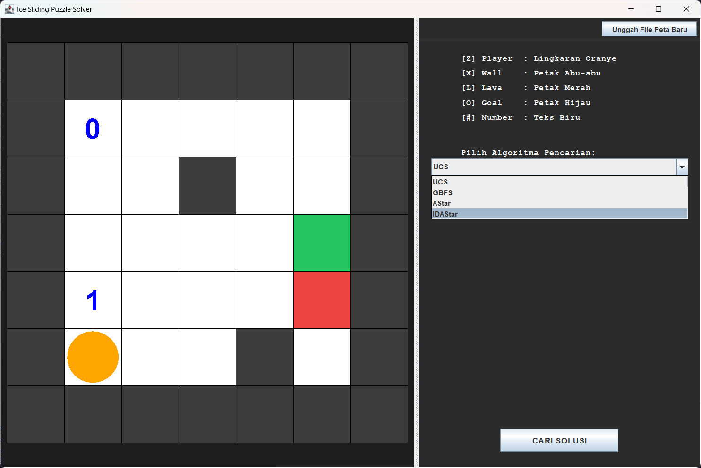

# Ice Sliding Puzzle Solver

> Tugas Kecil 3 IF2211 Strategi Algoritma

<p align="center">  </p>

Program ini merupakan implementasi solver permainan Ice Sliding Puzzle menggunakan beberapa algoritma pathfinding. Program dapat mencari solusi puzzle berdasarkan traversal cost, checkpoint angka, serta aturan sliding movement pada papan permainan.

## Fitur

- Uniform Cost Search (UCS)
- Greedy Best First Search (GBFS)
- A\* Search
- Iterative Deepening A* (IDA*)
- Multiple heuristic support
- Playback solusi
- Command Line Interface (CLI)
- Graphical User Interface (GUI)
- Penyimpanan solusi ke file `.txt`

---

# Requirement

Program membutuhkan:

- Java JDK 17 atau lebih baru (Tested on OpenJDK 21)

---

# Dependency Tambahan (Linux / WSL)

GUI menggunakan Java Swing sehingga membutuhkan dukungan X11 apabila dijalankan melalui WSL.

## Ubuntu / Debian

Install Java:

```bash
sudo apt update
sudo apt install openjdk-21-jdk
```

Jika menggunakan GUI di WSL, install dependency X11:

```bash
sudo apt install x11-apps
```

Untuk WSL:

- gunakan WSLg (Windows 11),
- atau gunakan X Server seperti VcXsrv/Xming pada Windows 10.

---

# Verifikasi Instalasi

Pastikan Java berhasil terinstall:

```bash
java --version
javac --version
```

---

# Struktur Project

```text
src/
└── solver/
    ├── algorithm/
    ├── core/
    ├── engine/
    ├── parser/
    ├── utils/
    ├── visualization/
    └── Main.java
```

---

# Cara Kompilasi

Masuk ke root project:

```bash
cd Tucil3_13524051_13524053
```

## Windows (PowerShell)

```powershell
javac -d out (Get-ChildItem -Recurse -Filter *.java | ForEach-Object { $_.FullName })
```

## Windows (CMD)

```cmd
javac -d out src\solver\Main.java src\solver\algorithm\*.java src\solver\algorithm\heuristic\*.java src\solver\core\*.java src\solver\engine\*.java src\solver\parser\*.java src\solver\utils\*.java src\solver\visualization\cli\*.java src\solver\visualization\gui\*.java
```

## Linux / macOS / WSL

```bash
javac -d out $(find src -name "*.java")
```

---

# Cara Menjalankan Program

Jalankan program:

```bash
java -cp out solver.Main
```

Program akan meminta:

- file input,
- algoritma,
- heuristik

---

# Format Input

Input menggunakan file `.txt`.

Contoh:

```text
7 7
XXXXXXX
X0****X
X**X**X
X****OX
X1***LX
XZ**X*X
XXXXXXX
999 999 999 999 999 999 999
999 3   5   2   8   1   999
999 7   4   999 6   9   999
999 2   8   3   5   4   999
999 6   1   7   2   999 999
999 9   3   4   999 8   999
999 999 999 999 999 999 999
```

Keterangan:

- `Z` : posisi awal
- `O` : goal
- `X` : obstacle
- `L` : lava
- `*` : tile biasa
- `0-9` : checkpoint angka

---

## Author

- 13524051 Mikhael Andrian Yonatan
- 13524053 Muhammad Haris Putra Sulastianto

Teknik Informatika, Institut Teknologi Bandung — 2026
